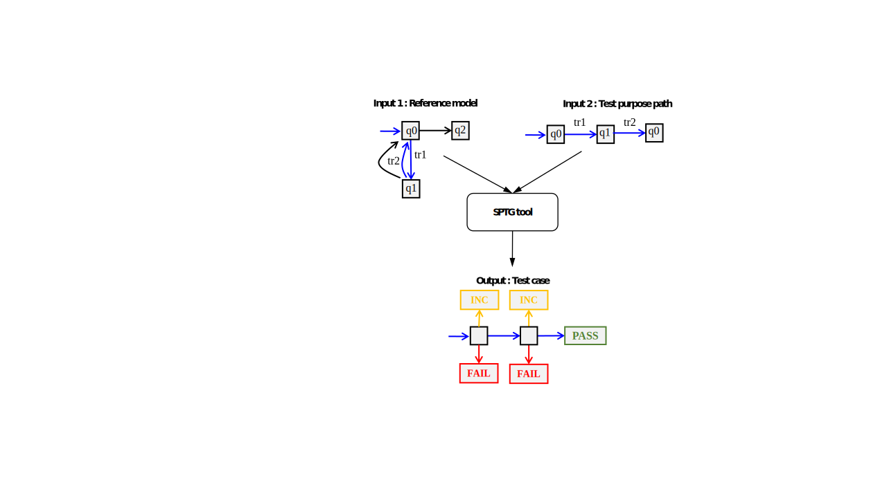
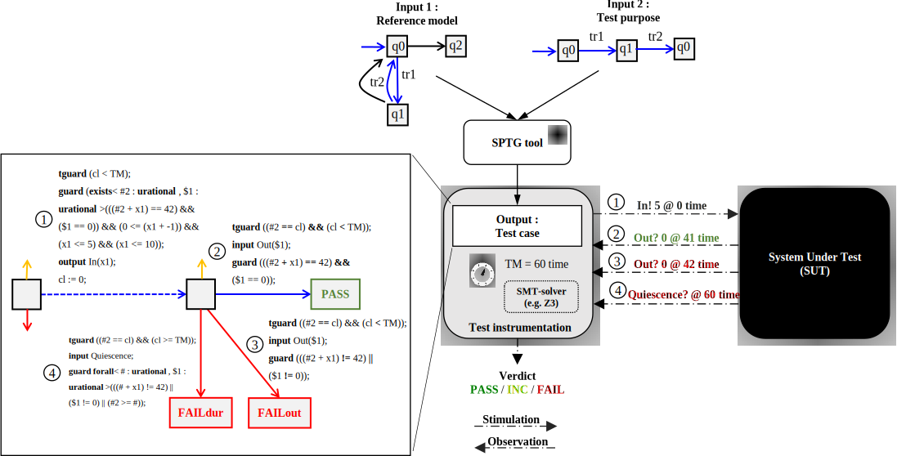
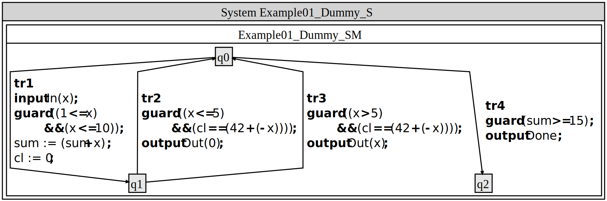
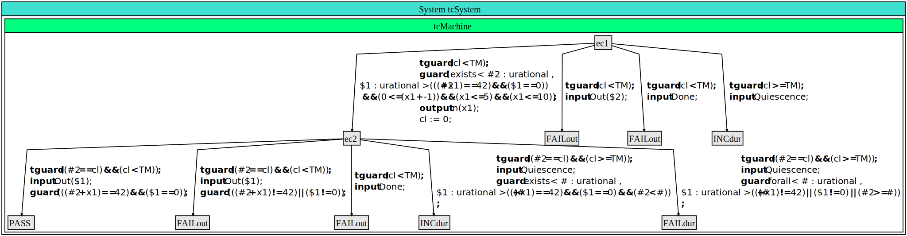

# SPTG: Symbolic Path-Guided Test Case Generator

## Table of content

1. [SPTG overview](#sptg-overview)
2. [Quick start with SPTG](#quick-start-with-sptg)
    - [First example](#first-example)
    - [Run all examples](#run-all-examples)
    - [Compilation instructions](#compilation-instructions)

3. SPTG tutorials  

   📘 Tutorial on model specification:

   `/path/to/SPTG/tutorials/model_specification.md`

   or `/path/to/SPTG/tutorials/model_specification.pdf`
   
   📘 Tutorial on test case generation:
   
   `/path/to/SPTG/tutorials/testcase_generation.md`

   or
   `/path/to/SPTG/tutorials/testcase_generation.pdf`
   
   📘 [Tutorial on test purpose selection:
   
    `/path/to/SPTG/tutorials/testpurpose_selection.md`

   or `/path/to/SPTG/tutorials/testpurpose_selection.pdf`
  
---

## SPTG overview

<div style="display: flex; flex-direction: column; align-items: center; margin: 20px 0;">
    
    <p style="text-align: center; font-size: 0.9em; color: #555; margin-top: 8px;">
        <strong>Figure 1:</strong> Schematic view of SPTG showing the model automaton with a selected test purpose (blue path) and the generated test case automaton with terminal verdict states.
    </p>
</div>

**SPTG** is a model-based test generation tool that automatically produces **conformance deterministic test cases** from system models combining both **data** and **timing constraints**. As shown in **Figure 1**, SPTG takes an **automaton model** and a **test purpose**, i.e., a path of the model, and generates the corresponding **test case automaton** with **verdict states** PASS, FAIL, INC (for inconclusive).


It relies on **path-guided symbolic execution**, which explores the input path and builds **symbolic constraints** over inputs and timing.
SPTG embeds the **Z3 SMT solver**, which is used to check the **satisfiability of path conditions** along the main test purpose path and its **immediate divergent paths**, as well as to ensure determinism.
Infeasible branches, inconsistent with the test purpose, are pruned early during symbolic exploration, avoiding dead paths that correspond to excluded behaviors.

  <div style="text-align: center; margin: 0 10px;">
    
    <p style="text-align: center; font-size: 0.9em; color: #555;"><strong>Figure 2:</strong> Execution of a generated test case against the System Under Test (SUT) with verdicts determined at runtime.</p>
  </div>


**Figure 2** illustrates the execution phase, where the generated test case interacts with the **System Under Test (SUT)**. During execution, **Z3** is used to solve the **stimulation conditions (guards)**, determining the inputs and timings to apply. Test case transitions are controlled by a clock cl, which satisfies cl < TM, where TM is the maximal waiting time before either applying a stimulation or observing an output. Quiescence, i.e., the obersvation of absence of output, is detected when cl >= TM, indicating that the system remains silent. This timing mechanism, combined with quiescence detection, ensures the test case is implementable in a real-time setting. Additionally, **Z3** checks that the **observed outputs** and their **timings** satisfy the corresponding observation conditions, after which verdicts are assigned.

### Applications

- **Model-Based Testing (MBT)** of systems with combined data and timing behaviors.  
- **Offline generation** of efficient and deterministic test cases from formal models.  
- **Teaching and demonstration** of symbolic execution and model-based test generation principles.

### References

**SPTG** implements the **symbolic path-guided test generation approach**, developed in: 👉 [https://doi.org/10.1016/j.scico.2025.103285](https://doi.org/10.1016/j.scico.2025.103285) *(Open Access)*.

As an extension of the symbolic execution platform Diversity ([https://projects.eclipse.org/proposals/eclipse-formal-modeling-project](https://projects.eclipse.org/proposals/eclipse-formal-modeling-project)), which is distributed under the Eclipse Formal Modeling Project, SPTG can leverage its coverage analyses for **test purpose selection**, providing an integrated environment for offline timed symbolic testing.

---

## Quick start with SPTG

SPTG directory Structure:

- `bin/`: This directory contains the SPTG tool binary `sptg.exe`. It also includes the PlantUML JAR and the Graphviz executable (`dot`), which together enable visualization and export of generated test cases in graphical PlantUML (SVG) format.

- `examples/`: This directory contains all examples. It has a subdirectory for each example and a script `run-all.sh` to run all preconfigured test case generation tasks. Each example subdirectory includes:
  - The reference model.
  - A preconfigured script `run-sptg.sh` that calls SPTG for test case generation using a test purpose path (a sequence of consecutive transitions of the model). 
  `run-all.sh` calls all `run-sptg.sh` scripts for each example.

- `tutorials/`: This directory contains three tutorials and associated files: tutorial on model specification; tutorial on test case generation; and tutorial on test purpose selection. The latter is a feature that SPTG inherits from extending the symbolic execution platform Diversity.

- `src/`: Contains the C++ source code of SPTG.

- `third-party/`: Directory for third-party libraries and dependencies.

- `Release/`: Contains release artifacts.

- `LICENSE`: The artifact license (same license as the Diversity symbolic execution platform).

- `examples-outputs.zip`: Compressed folder containing outputs generated by executing all examples from our experiments.

- `README`: This file.


### First example

```sh
cd /path/to/SPTG/examples/example02_dummy/
./run-sptg-h2.sh
```


This script instructs **SPTG** to generate a **test case** with the following specifications:

- **Reference model:**  
  `/path/to/SPTG/examples/example02_dummy/example02_dummy.xlia`

- **Test purpose:** Defined as the **sequence of transitions**: `tr1; tr2`

- **Action:**  Generate a **test case** corresponding to the given reference model and test purpose.


<div style="padding-top: 5px; padding-bottom: 5px;"></div>

> **Note:**  
> The input reference model automaton is encoded in the **XLIA language** (file `.xlia`), the input language of the **Diversity** symbolic execution platform. **SPTG** extends Diversity with dedicated functionality for symbolic path-guided test case generation. See tutorial on model specification for more details.

<div style="padding-top: 5px; padding-bottom: 5px;"></div>

**SPTG** generates the resulting **test case automaton** in the following formats:


- **Graphical format: PlantUML**  
  **File** `/path/to/SPTG/examples/example02_dummy/output_h2/testcase.puml`  
  *Comment:* This file provides a visual representation of the test case automaton, which can be rendered using PlantUML.

- **Specification language: XLIA**  
  The same language used to express the reference model.  
  **File** `/path/to/SPTG/examples/example02_dummy/output_h2/testcase.xlia`  
  *Comment:* This file can be explored using the symbolic execution platform Diversity.

- **JSON format with SMT-LIB guards**  
  **File** `/path/to/SPTG/examples/example02_dummy/output_h2/testcase_smt.json`  
  *Comment:* This JSON file encodes the test case automaton, including guards in SMT-LIB format, suitable for automated execution againt system under test (SUT) using an SMT-solver (e.g. Z3).

> **Note:** The script also generates the graphical **PlantUML** file for the reference automaton:  
> **File** `/path/to/SPTG/examples/example02_dummy/output_h2/example02_dummy.puml`  
> *Comment:* This file provides a visual representation of the reference automaton. 

> **Note:** You can visualize `.puml` files using [PlantUML](https://github.com/plantuml/plantuml/releases) or the online tool [PlantText](https://www.planttext.com/). You can convert a file `.puml` to a file `.svg` (see the [PlantUML Conversion Guide](#plantuml-puml-to-svg-conversion-guide)).

> **Note:** If the **PlantUML JAR** and the Graphviz `dot` executable are located in `/path/to/SPTG/bin`, the script automatically produces:  
> **File** `/path/to/SPTG/examples/example02_dummy/testcase.svg`.
   


The table below summarizes the inputs and outputs for generating a **test case** with SPTG. The figures shown are **visual representations** obtained by converting the corresponding **PlantUML** files into **SVG** format.


| **Description** | **Content** |
|-----------------|-------------|
| **Input 1:** *Reference system model (Timed Symbolic Automaton)* |  |
| **Input 2:** *Test purpose (Sequence of transitions)* | `tr1; tr2` |
| **Output:** *Generated test case (Deterministic Timed Symbolic Automaton)* |  |

### Run all examples
```sh
cd /path/to/SPTG/examples/
./run-all.sh
```
### Compilation instructions
To compile SPTG, navigate to the `Release` directory:
```bash
cd Release/
```
Then build the project:
```bash
make all -j4
```
During compilation, the process automatically overwrites the existing `sptg.exe` in the `bin` directory using:
```bash
cp -f sptg.exe ../bin/sptg.exe
```
If you wish to preserve the existing executable, rename it before compilation for instance as follows:
```bash
mv ../bin/sptg.exe ../bin/sptg_old.exe
```
---

## PlantUML: PUML to SVG Conversion Guide

A concise reference for converting `.puml` files to `.svg` images via the command line.  
PlantUML requires **Graphviz** for diagram rendering.

---

## Prerequisites

1. **Java Runtime Environment (JRE):** Required to execute PlantUML.  
2. **PlantUML JAR File:** The standalone PlantUML application.  
3. **Graphviz:** Used internally by PlantUML for layout and rendering.  
   After installation, Graphviz will be available in your system path.

---

## a. Installation

### Install Graphviz
On Debian/Ubuntu-based systems, install Graphviz with:

```bash
sudo apt install graphviz
```
After this, the `dot` executable will be available system-wide.

### b. Download PlantUML

Get the latest stable release of `plantuml.jar` from:  
👉 [https://github.com/plantuml/plantuml/releases](https://github.com/plantuml/plantuml/releases)

Ensure both `java` and `dot` commands are available:

```bash
java -version
dot -V
```

### c. Conversion Command

Navigate to the folder containing both `plantuml.jar` and your `.puml` file.

Use the `-tsvg` flag to generate an SVG image:

| **Command** | **Action** |
|--------------|------------|
| `java -jar plantuml.jar -tsvg yourfile.puml` | Converts the input file (`.puml`) to an SVG output (`.svg`). |

#### Example

```bash
# Generates 'MyDiagram.svg'
java -jar plantuml.jar -tsvg MyDiagram.puml
