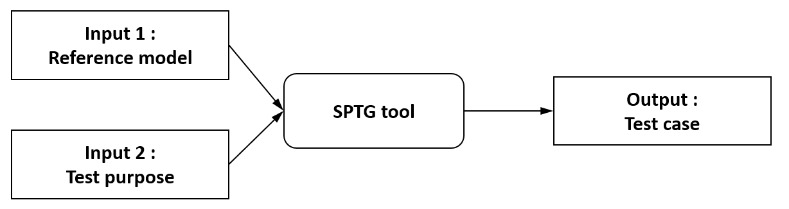
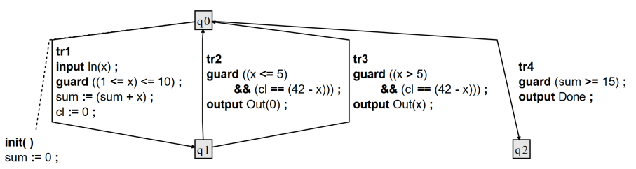
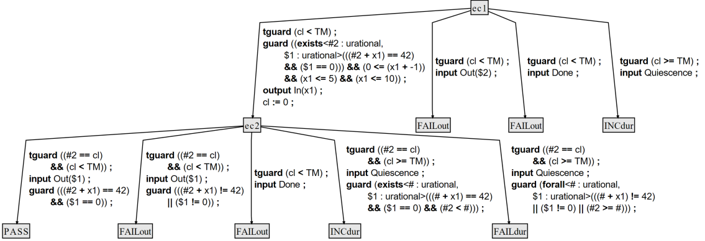

# SPTG: Symbolic Path-Guided Test Case Generator

**SPTG** is a model-based test generation tool that automatically produces **conformance test cases** from system models mixing **data** and **timing constraints**.  
It relies on **path-guided symbolic execution**, which follows a selected consecutive sequence of transitions (the **test purpose path**) while collecting symbolic constraints on inputs and timing.

---

## Key Features

- **Symbolic execution** — Generates test cases along *test purpose paths* by accumulating symbolic constraints on input data and timing conditions.  
- **Unified treatment of data, time, and quiescence** — Supports both data and clock variables, and distinguishes between *expected quiescence* (permitted silence within a delay) and *missing outputs* (silence when an output is expected).  
- **Deterministic path selection** — Only deterministic paths are used; non-deterministic ones are discarded, ensuring unambiguous, executable test cases that align with the symbolic execution tree.  
- **Concise test cases** — Infeasible branches are pruned, and redundant constraints are simplified to keep the test cases minimal.  
- **Coverage-oriented testing** — Test purpose paths can be user-defined or automatically selected from reference system model. As an extension of the Diversity symbolic execution platform, SPTG inherits advanced coverage analysis and test selection capabilities.

---

## Applications

- **Model-Based Testing (MBT)** of systems with combined data and timing behaviors.  
- **Offline generation** of efficient and deterministic test suites from formal models.  
- **Teaching and demonstration** of symbolic execution and model-based test generation principles.

SPTG implements the **Symbolic Path-Guided Test Generation** approach described in:  
👉 [https://doi.org/10.1016/j.scico.2025.103285](https://doi.org/10.1016/j.scico.2025.103285) *(Open Access)*

---

## SPTG Tool I/O Flow

<div style="padding-top: 20px; padding-bottom: 20px;"></div>

<center>

</center>

<div style="padding-top: 20px; padding-bottom: 20px;"></div>

| **Description** | **Content** |
|------------------|-------------|
| **Input 1:** *Timed symbolic automaton — Reference system model* |  |
| **Input 2:** *Sequence of transitions (path) — Test purpose* | `tr1.tr2` |
| **Output:** *Deterministic timed symbolic automaton — Generated test case* |  |

---

## Using SPTG
```
./bin/sptg.exe ./examples/example02_dummy/workflow_4_testcase_generation.sew```

```
excerpt of symbolic execution workflow file ```./examples/example02_dummy/workflow_4_testcase_generation.sew``` 
```
project 'location of input reference model' [
    source = "."
    model  = "example02_dummy.xlia"
] // end project
...
path#guided#testcase#generator testcase_genertor {
    trace 'input test purpose' [
        transition = "tr1"
        transition = "tr2"
    ] // end trace
    vfs 'location and name of generated test case' [
        folder = "output"
        file#tc       = "testcase.xlia"
        file#tc#puml  = "testcase.puml"
    ] // end vfs
    ...
}
```
This workflow instructs SPTG to generate a **test case** from the **reference model** (`example02_dummy.xlia`) using the **sequence of transitions** (`tr1`, `tr2`) that define the *test purpose*.

> **Note:**  
> The input reference model automaton is encoded in the **XLIA language**, the input language of the **Diversity** symbolic execution platform.  
> SPTG extends Diversity with dedicated functionality for symbolic path-guided test generation.  
> See [model_specification](tutorials/model_specification.md) for more details.

SPTG generates the resulting **test case automaton** in both **XLIA** and **PlantUML** formats.  
You can convert the `.puml` output to `.svg` using **PlantUML** (see the [PlantUML Conversion Guide](#plantuml-puml-to-svg-conversion-guide)) or the online tool [PlantText](https://www.planttext.com/).

Tutorials are available on:
- Model specification for SPTG  
- Test case generation using SPTG  
- Test purpose selection (inherited from the Diversity platform)

📘 [See Tutorials](tutorials/README.md)

---

## Compilation Instructions

*(To be completed with compilation steps)*

---

## PlantUML: PUML to SVG Conversion Guide

A quick reference for converting `.puml` files to `.svg` images via the command line.

### Prerequisites

1. **Java Runtime Environment (JRE):** Required to execute PlantUML.  
2. **PlantUML JAR File:** The standalone application.

### 1. Download PlantUML

Get the latest stable release of `plantuml.jar` from the official site:  
👉 [https://sourceforge.net/projects/plantuml/files/](https://sourceforge.net/projects/plantuml/files/)

### 2. Conversion Command

Navigate to the folder containing both `plantuml.jar` and your `.puml` file.

Use the `-tsvg` flag to generate an SVG image:

| **Command** | **Action** |
|--------------|------------|
| `java -jar plantuml.jar -tsvg yourfile.puml` | Converts the input file (`.puml`) to an SVG output (`.svg`). |

#### Example

```bash
# Generates 'MyDiagram.svg'
java -jar plantuml.jar -tsvg MyDiagram.puml
