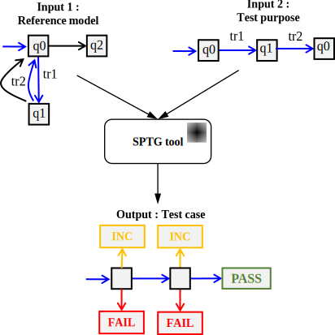

# SPTG: Symbolic Path-Guided Test Case Generator

**SPTG** is a model-based test generation tool that automatically produces **conformance deterministic test cases** from system models combining both **data** and **timing constraints**. 
It relies on **path-guided symbolic execution**, which explores a selected sequence of transitions (the **test purpose path**) and incrementally builds the corresponding **symbolic constraints** over inputs and timing. 
These constraints are then solved using an **SMT solver** to determine **feasible symbolic paths**, ensuring that each generated test case corresponds to an **executable behavior** of the system under test.

## Applications

- **Model-Based Testing (MBT)** of systems with combined data and timing behaviors.  
- **Offline generation** of efficient and deterministic test suites from formal models.  
- **Teaching and demonstration** of symbolic execution and model-based test generation principles.

## References
SPTG implements the **symbolic path-guided test generation approach** developped in:  
👉 [https://doi.org/10.1016/j.scico.2025.103285](https://doi.org/10.1016/j.scico.2025.103285) *(Open Access)*

---

## Table of content

1. [SPTG overview](#sptg-overview)
2. [SPTG evaluation](#sptg-evaluation)
3. SPTG tutorials  
   📘 [Tutorial on model specification](tutorials/model_specification.md)  
   📘 [Tutorial on test case generation](tutorials/testcase_generation.md)  
   📘 [Tutorial on test purpose selection](tutorials/testpurpose_selection.md)

---

## SPTG overview

<div style="padding-top: 20px; padding-bottom: 20px;"></div>

<center>

</center>

<div style="padding-top: 20px; padding-bottom: 20px;"></div>

| **Description** | **Content** |
|------------------|-------------|
| **Input 1:** *Timed symbolic automaton : Reference system model* |  |
| **Input 2:** *Sequence of transitions (path) : Test purpose* | `(tr1, tr2)` |
| **Output:** *Deterministic timed symbolic automaton : Generated test case* |  |

---

## SPTG evaluation

SPTG directory Structure:

- `examples`
- `tutorials`
- `src`
- `third-party`
- `Release`


```
PATH_TO_SPTG/bin/sptg.exe PATH_TO_SPTG/examples/example02_dummy/workflow_4_testcase_generation.sew
```

Excerpt of symbolic execution workflow file ```PATH_TO_SPTG/examples/example02_dummy/workflow_4_testcase_generation.sew``` 
```
project 'location of input reference model' [
    source = "."
    model  = "example02_dummy.xlia"
] // end project
...
path#guided#testcase#generator testcase_genertor {
    trace 'input test purpose' [
        transition = "tr1"
        transition = "tr2"
    ] // end trace
    vfs 'location and name of generated test case' [
        folder = "output"
        file#tc       = "testcase.xlia"
        file#tc#puml  = "testcase.puml"
    ] // end vfs
    ...
}
```
This workflow instructs SPTG to generate a **test case** from the **reference system model** (`example02_dummy.xlia`) using the **sequence of transitions** `(tr1, tr2)` that define the *test purpose*.

<div style="padding-top: 5px; padding-bottom: 5px;"></div>

> **Note:**  
> The input reference model automaton is encoded in the **XLIA language**, the input language of the **Diversity** symbolic execution platform. **SPTG** extends Diversity with dedicated functionality for symbolic path-guided test generation.See [model_specification](tutorials/model_specification.md) for more details.

<div style="padding-top: 5px; padding-bottom: 5px;"></div>

SPTG generates the resulting **test case automaton** in the follwoing formats:

- specification langauge **XLIA** the same langauge used to express the reference model (`PATH_TO_SPTG/examples/example02_dummy/output/testcase.xlia`) 

- in graphical format **PlantUML** (`PATH_TO_SPTG/examples/example02_dummy/output/testcase.puml`). 

- In addition, SPTG generates the test case automaton in JSON format with guards expressed in SMT-LIB format (`PATH_TO_SPTG/examples/example02_dummy/output/testcase_smt.json`).

You can visualize `.puml` files using [PlantUML](https://github.com/plantuml/plantuml/releases) or the online tool [PlantText](https://www.planttext.com/).

You can convert a file `.puml` to a file `.svg` (see the [PlantUML Conversion Guide](#plantuml-puml-to-svg-conversion-guide)).

---

## Compilation Instructions
To compile SPTG, navigate to the `Release` directory of the `org.eclipse.efm.symbex` module:
```bash
cd PATH_TO_SPTG/org.eclipse.efm.symbex/Release/
```
Then build the project:
```bash
make all -j4
```
During compilation, the process automatically overwrites the existing `sptg.exe` in the `bin` directory using:
```bash
cp -f sptg.exe ../../bin/sptg.exe
```
If you wish to preserve the existing executable, rename it before compilation as follows:
```bash
mv ../../bin/sptg.exe ../../bin/sptg_old.exe
```
---

## PlantUML: PUML to SVG Conversion Guide

A quick reference for converting `.puml` files to `.svg` images via the command line.

### Prerequisites

1. **Java Runtime Environment (JRE):** Required to execute PlantUML.  
2. **PlantUML JAR File:** The standalone application.

### 1. Download PlantUML

Get the latest stable release of `plantuml.jar` from the official github site:  
👉 [https://github.com/plantuml/plantuml/releases](https://github.com/plantuml/plantuml/releases)

### 2. Conversion Command

Navigate to the folder containing both `plantuml.jar` and your `.puml` file.

Use the `-tsvg` flag to generate an SVG image:

| **Command** | **Action** |
|--------------|------------|
| `java -jar plantuml.jar -tsvg yourfile.puml` | Converts the input file (`.puml`) to an SVG output (`.svg`). |

#### Example

```bash
# Generates 'MyDiagram.svg'
java -jar plantuml.jar -tsvg MyDiagram.puml
