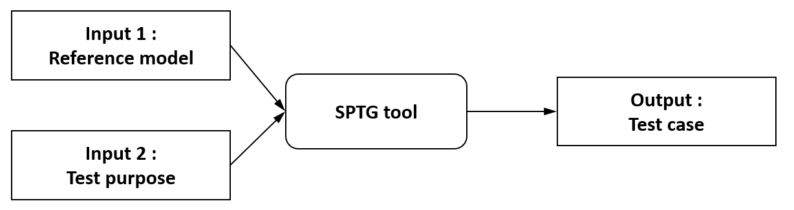
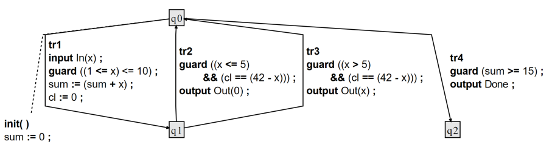
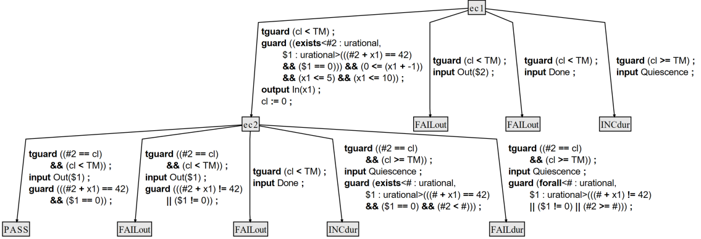

# SPTG

## 🧩 SPTG: Symbolic Path-Guided Test Generation Tool


**SPTG** generates conformance test cases from system models combining data and timing constraints. It uses path-guided symbolic execution, following a chosen sequence of transitions (the test path) and collecting constraints on inputs and timing.  

## Key Features

- **Symbolic execution**: Generates tests along test purpose paths, accumulating symbolic constraints on inputs and their timing.  
- **Data, timing & quiescence**: Handles clocks and data variables uniformly, distinguishing valid quiescence (expected silence within allowed delay) from missing outputs (silence when an output is expected).  
- **Deterministic paths**: Only paths that are deterministic are used; non-deterministic paths are dropped, ensuring unambiguous test cases that mirror the symbolic execution tree.  
- **Concise tests**: Prunes infeasible branches and simplifies redundant constraints.  
- **Coverage support**: Test paths can be user-defined or automatically selected, with SPTG working as an extension of the Diversity platform for coverage analysis and test selection.

## Applications

- **Model-Based Testing** of systems with timing and data-dependent behavior.    
- **Offline generation** of efficient, deterministic test suites from models.
- **Demonstrations and teaching** of symbolic execution and test generation.


SPTG is based on the symbolic path-guided test case generation approach https://doi.org/10.1016/j.scico.2025.103285 (Open access)


## SPTG Tool I/O Flow

<div style="padding-top: 20px; padding-bottom: 20px;">
</div>

<center>


</center>

<div style="padding-top: 20px; padding-bottom: 20px;">
</div>

<table class="spaced-table">
  <thead>
    <tr>
      <th>Description</th>
      <th>Content</th>
    </tr>
  </thead>
  <tbody>
    <tr>
      <td><b>Input 1 : Timed symbolic automaton - Reference system model</b></td>
      <td></td>
    </tr>
    <tr>
      <td><b>Input 2 : Consecutive sequence of transitions (path) of the model - Test purpose</b></td>
      <td>
      <b>tr1.tr2</b>
      </td>
    </tr>
    <tr>
      <td><b>Output : Deterministic timed symbolic automaton - Test case</b></td>
      <td></td>

      
    </tr>
  </tbody>
</table>


## How to compile SPTG


## How to use SPTG

```
sptg.exe example01_tc.sew

```


**Example01 -- Simple timed system (no symbolic data)**


**More on XLIA subset to encode timed symbolic transition system**


```
// ============================================================
// Prologue - Header
// ============================================================
@xlia< system , 1.0 >:

// ============================================================
// System Definition
// ============================================================
timed system S {

    // ========================================================
    // Composite Part: State Machine Definition
    // ========================================================
    @composite:
    statemachine SM {
        @public:

            // ----------------------------------------------
            // Declaration of Ports
            // ----------------------------------------------
            port input  In;
            port output Done;
            port input  In1( urational );
            port input  In2( integer );
            port output Out( urational );

            // Declaration of N-ary Ports
            port input  In3( bool, integer, rational );
            port output Out2( integer, bool );

            // ----------------------------------------------
            // Declaration of Constants
            // ----------------------------------------------
            const integer N = 42;

        @private:

            // ----------------------------------------------
            // Declaration of Variables
            // ----------------------------------------------
            var urational sum;
            var urational x;
            var urational y;
            var integer   z;
            var bool      flag;
            var integer   fee;

            // ----------------------------------------------
            // Declaration of Clocks
            // ----------------------------------------------
            var clock urational cl;
            var clock urational cl2;

        // ====================================================
        // Behavioral Description: States and Transitions
        // ====================================================
        @region:

            // ----------------------------------------------
            // Initial State
            // ----------------------------------------------
            state<start> q0 {
                @init {
                    sum  := 0;
                    flag := false;
                    guard( fee > 0 );
                }

                transition tr1 --> q1 {
                    input In1( x );
                    guard ( 1 <= x <= 10 );
                    sum := sum + x;
                    y   := sum;
                    cl  := 0;
                }

                transition tr2 --> q1 {
                    input In( x );
                    guard ( 10 < x && x < N );
                    {|,|
                        sum := sum + x;
                        y   := sum; // y receives the pre-increment sum value
                    }
                    cl2 := 0;
                }
            }

            // ----------------------------------------------
            // Secondary State
            // ----------------------------------------------
            state q1 {
                transition tr3 --> q0 {
                    guard( x <= 10 && cl == N - x );
                    output Out( sum - 1 );
                }

                transition tr4 --> q0 {
                    guard( x > 10 );
                    guard( cl <= 5 );
                    output Out2( fee, flag );
                    flag := true;
                    cl2 := 0;
                }

                transition tr5 --> q2 {
                    guard( sum >= 15 && cl2 <= 1 );
                    output Done;
                    cl2 := 0;
                }
            }

            // ----------------------------------------------
            // Terminal State
            // ----------------------------------------------
            state q2;

        // ====================================================
        // Communication Part: Port Connections
        // ====================================================
        @com:
        connect< env > {
            input  In;
            input  In1;
            input  In2;
            input  In3;
            output Done;
            output Out;
            output Out2;
        }
    }
}

```


