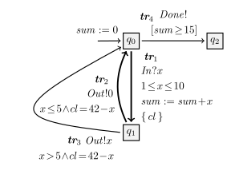
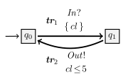

<!---
<script type="text/javascript" src="http://cdn.mathjax.org/mathjax/latest/MathJax.js?config=TeX-AMS-MML_HTMLorMML"></script>
<script type="text/x-mathjax-config"> MathJax.Hub.Config({ tex2jax: {inlineMath: [['$', '$']]}, messageStyle: "none" });</script>
--->

# Timed symbolic transition system - Reference system model specification


SPTG automata models, called **timed symbolic transition systems**, will be introduced in the following using a small dummy one, $\mathbb{G}$ sufficient to illustrate the main components:


<div style="padding-top: 20px; padding-bottom: 20px;">
</div>

<center>


</center>

<div style="padding-top: 20px; padding-bottom: 20px;">
</div>

Channels are $C$ = { $In$, $Out$, $Done$ }, data variables are $A$ = { $x$, $sum$ }, and clocks are $K$ = { $cl$ }.  
Clock $cl$ ranges over positive rationals, providing a dense time domain, and measures elapsed time.  
Variable $x$ stores incoming values, while variable $sum$ accumulates them (initialized to $0$).  

Channels are typed and declared as input or output:
- $In?x$ binds $x$ to a value of the type of $In$ (here, positive rationals),
- $Out!t$ emits a value $t$ of the type of $Out$,
- channels without data, like $Done$, have undefined type.

A **transition** is a tuple  $(q, act, \phi, \mathbb{K}, \rho, q')$,  
where:
- $q, q'$ are states,
- $act$ is an input/output action,
- $\phi$ is a guard,
- $\mathbb{K} \subseteq K$ is the set of clocks to reset,
- $\rho$ is an update $\{x_1 := t_1, \ldots, x_n := t_n\}$ on data variables (where terms $t_i$ may involve clocks).

When $\rho = id$, variables remain unchanged; only relevant updates are shown.

The system $\mathbb{G}$ has three states $q_0, q_1, q_2$ and four transitions:

- **$\mathbf{tr}_1$** = $(q_0, In?x, 1 \leq x \leq 10,$ { $cl$ } $, sum := sum + x, q_1)$  
  → processes inputs;

- **$\mathbf{tr}_2$** = $(q_1, Out!0, x \leq 5 \wedge cl = 42 - x, \emptyset, id, q_0)$  
  → emits $0$ for small inputs;

- **$\mathbf{tr}_3$** = $(q_1, Out!x, x > 5 \wedge cl = 42 - x, \emptyset, id, q_0)$  
  → emits the received value otherwise;

- **$\mathbf{tr}_4$** = $(q_0, Done!, sum \geq 15, \emptyset, id, q_2)$  
  → may signal termination when the accumulated sum reaches $15$.

## Encoding of the timed symbolic transition system in XLIA

The SPTG framework, being an extension of the Diversity symbolic execution platform, uses its entry language to express models of timed symbolic transition systems. This language, called **XLIA** (**eXecutable Language for Interaction and Architecture**), is designed for specifying the behavior of component-based systems.

In XLIA, components are referred to as machines. These machines are communicating, hierarchical, and heterogeneous, and their evaluation semantics can be customized to support different analysis or execution contexts. 

The complete XLIA documentation is available here `/path/to/SPTG/tutorials/DiversityLangaugeXlia_documentation.pdf`.

For timed symbolic transition systems, a single machine is typically used to represent the system under study, which interacts with its environment through well-defined communication interfaces.


The automaton $\mathbb{G}$ is encoded **XLIA** as follows:

**File** `/path/to/SPTG/examples/example02_dummy/example02_dummy.xlia`

```xlia
timed system Example02_Dummy_S {

@composite:
	statemachine Example02_Dummy_SM {
	@public:
		port input  In( urational );
		port output Out( urational );
		port output Done;
	@private:
		var urational       sum;
		var urational       x;
		var clock urational cl;
	@region:
	
	    state< start > q0 {
	    	@init{
	    		sum := 0;
	    	}
	        transition  tr1 --> q1 { 
	            input In( x );
	            guard ( 1 <= x <= 10 );
	            sum := sum+x;
	            cl  := 0;
	        }                   
	        transition  tr4 --> q2 { 
	            guard ( sum >= 15 );
	            output Done;
	        }                   
	    }
	    state q1 {
	        transition tr2 --> q0 {
	        	guard ( x <= 5 && cl == 42-x );
	            output Out( 0 );
	        }
	        transition tr3 --> q0 {
	        	guard ( x > 5 && cl == 42-x );
	            output Out( x );
	        }
        }
        	    
       	state< terminal > q2;
       	
	@com:
		connect< env >{
			input  In;
			output Out;
			output Done;
		}
	 }
}
```
---
## 1. General Structure
---
The **XLIA model** encodes the automaton by explicitly separating the **static part** (declarations of variables, clocks, and communication ports) from the **behavioral part** (states, transitions, and synchronization).  
The `timed system` construct defines the **whole system**, while the nested `statemachine` block defines the actual automaton.

---
## 2. Static Part
---
The static part declares:

- **Ports** (inputs/outputs), which correspond to the external interactions of the automaton.
- **Variables** (data and clocks), which capture internal state and timing information.

From the XLIA model:

```xlia
@public:
	port input  In( urational );
	port output Out( urational );
	port output Done;
@private:
	var urational       sum;
	var urational       x;
	var clock urational cl;
```

### Mapping to the automaton


| XLIA element | Meaning | Automaton equivalent |
| :--- | :--- | :--- |
| `port input In(urational)` | **Input port** for receiving a rational value | Input channel typed positive rational |
| `port output Out(urational)` | **Output port** for sending a rational value | Output channel typed positive rational|
| `port output Done` | **Output signal** without data | Output channel with undefined type  |
| `var urational sum` | **Data variable** (tracking accumulated input) | Data variable (used in guards/updates) |
| `var urational x` | **Data variable** (holding the latest input) | **Data variable** (used in guards/updates/actions) |
| `var clock urational cl` | **Clock variable** (measures elapsed time since last reset) | Clock for **timed constraints** |

---

Thus, the static part declares the **interface** and **internal state space** of the automaton.

---
## 3. Behavioral Part
---
The behavioral description is under `@region`, where states and transitions are defined.

```xlia
@region:
    state< start > q0 { ... }
    state q1 { ... }
    state< terminal > q2;
```

**States**

q0: Initial state (`< start >`), where sum is initialized.

q1: Intermediate state reached after an input.

q2: Final or terminal state when the condition `sum >= 15` holds.

**Initialisation**
```
@init {
	sum := 0;
}
```

**Transitions from q0**

```
transition tr1 --> q1 { 
    input In( x );
    guard ( 1 <= x <= 10 );
    sum := sum+x;
    cl  := 0;
}                   
transition  tr4 --> q2 { 
    guard ( sum >= 15 );
    output Done;
}
```

## Transition Mapping

| Transition | Automaton equivalent | 
| :--- | :--- | 
| **tr1** | $(q_0, In?x, 1 \leq x \leq 10,$ { $cl$ }$, sum := sum+x, q_1)$ | 
| **tr4** | $$(q_0, Done!, sum \geq 15, \emptyset, id, q_2)$$ | 


**Transitions form q1**

```xlia
transition tr2 --> q0 {
	guard ( x <= 5 && cl == 42-x );
	output Out( 0 );
}
transition tr3 --> q0 {
	guard ( x > 5 && cl == 42-x );
	output Out( x );
}
```

| Transition | Automaton equivalent | 
| :--- | :--- | 
| **tr2** | $$(q_1, Out!0, x \leq 5 \wedge cl = 42 - x, \emptyset, id, q_0)$$ |
| **tr3** | $$(q_1, Out!x, x > 5 \wedge cl = 42 - x, \emptyset, id, q_0)$$ | 
---
## 4. Communication Interface
---
The `@com` section defines how this state machine interacts with the environment:

```xlia
@com:
	connect< env >{
		input  In;
		output Out;
		output Done;
	}
```

This binds the declared input/output ports to the environment.

---
## 5. Summary: Automaton versus XLIA Correspondence
---

| Automaton Concept | XLIA Encoding |
| :--- | :--- |
| **Locations** $q_0, q_1, q_2$ | `state q0`, `state q1`, `state q2` |
| **Initial location** | `state< start >` |
| **Transitions** | `transition trX --> qY { ... }` |
| **Guards** | `guard(...)` expressions |
| **Clocks** | Declared with `var clock urational cl` |
| **Clock resets** | Assignments like `cl := 0` |
| **Input actions** | `input In(x)` |
| **Output actions** | `output Out(...)` or `output Done` |
| **Variable updates** | Direct assignments inside transition body |
| **Terminal state** | `state< terminal > q2;` (no outgoing transitions) |

<div style="padding-top: 20px; padding-bottom: 20px;">
</div>

**Other example: Timed system (no data)**


<center>


</center>

<div style="padding-top: 20px; padding-bottom: 20px;">
</div>

**Channels** $C$ = { $In$, $Out$ }

**Clocks** $K$ = { $cl$ }

**Data Variables** $A$ = $\emptyset$ (No data variables).

The automaton has two states $q_0$ and $q_1$ and two transitions as follows.

- **$\mathbf{tr}_1$** = $(q_0, In?, True,$ { $ cl$ } $, id, q_1)$  
    * **Action**: $In?$ (Receives an input on $In$).
    * **Guard**: $\phi = true$ (Always enabled when in $q_0$).
    * **Reset**: $\mathbb{K}$ = { $cl$ } (Resets the clock $cl$ to $0$).
    * **Update**: $\rho = id$ (No variable updates).
    
    $\rightarrow$ Upon receiving an input on $In$, the system moves from $q_0$ to $q_1$ and restarts the clock $cl$.

- **$\mathbf{tr}_2$** = $(q_1, Out!, cl \leq 5, \emptyset, id, q_0)$
    * **Action**: $Out!$ (Sends an output on $Out$).
    * **Guard**: $\phi = cl \leq 5$ (Can only be taken if $cl$ is less than or equal to $5$).
    * **Reset**: $\mathbb{K} = \emptyset$ (No clocks are reset).
    * **Update**: $\rho = id$ (No variable updates).
    
    $\rightarrow$ If the clock $cl$ has not exceeded $5$, the system sends an output on $Out$ and moves from $q_1$ back to $q_0$.

Encoding in XLIA:

**File** `/path/to/SPTG/examples/example01_basic_timed_system/example01_basic_timed_system.xlia`

```xlia
@xlia< system , 1.0 >:

timed system Example01_S {

@composite:
	statemachine Example01_SM {
	@public:
		port input  In;
		port output Out;
		
	@private:
		var clock urational cl;
			
	@region:
	
	    state< start > q0 {
	        transition  tr1 --> q1 { 
	            input In;
	            cl := 0;
	        }                                    
	    }
	    state q1 {
	        transition tr2 --> q0 {
	        	guard ( cl <= 5 );
	            output Out;
	        }
        }
    @com:
		connect< env >{
			input  In;
			output Out;
		}
	}
}
```
> **Note:**  
> To encode updates in **XLIA**, we use two ways: **sequential statements** (user-friendly) and **simultaneous statements** (formal semantics).  
> Both forms are used for **automaton initialization** and **transition updates**, with the latter ensuring full compliance with the formalism.  
>
> - **Sequential form:** statements execute **in order**, each using the **latest state**.  
>   Example:  
>   ```xlia
>   a := b;
>   c := a;
>   ```  
>   After execution: `a` takes `b`’s value, and `c` takes the **new value** of `a` (i.e. `c := b`).  
>
> - **Simultaneous form:** a block is evaluated as a **single function** from the **initial state**, using the operator `|,|`:  
>   ```xlia
>   |,| {
>       a := b;
>       c := a;
>   }
>   ```  
>   This enforces **parallel assignment** semantics:  
>   `a`’s new value = old `b`, and `c`’s new value = old `a`.

**More on XLIA subset to encode timed symbolic transition systems**

```
// ============================================================
// Prologue - Header
// ============================================================
@xlia< system , 1.0 >:

// ============================================================
// System Definition
// ============================================================
timed system S {

    // ========================================================
    // Composite Part: State Machine Definition
    // ========================================================
    @composite:
    statemachine SM {
        @public:

            // ----------------------------------------------
            // Declaration of N-ary Ports
            // ----------------------------------------------
            port input  In;
            port output Done;

            port input  In1( urational );
            port input  In2( integer );
            port output Out( urational );

            port output Out2( integer, bool );

            port input  In3( bool, integer, rational );

            // ----------------------------------------------
            // Declaration of Constants
            // ----------------------------------------------
            const integer N = 42;

        @private:

            // ----------------------------------------------
            // Declaration of Variables
            // ----------------------------------------------
            var urational sum;
            var urational x;
            var urational y;
            var integer   z;
            var bool      flag;

            // ----------------------------------------------
            // Declaration of Clocks
            // ----------------------------------------------
            var clock urational cl;
            var clock urational cl2;

        // ====================================================
        // Behavioral Description: States and Transitions
        // ====================================================
        @region:

            // ----------------------------------------------
            // Initial State
            // ----------------------------------------------
            state< start > q0 {
                @init {
                    sum  := 0;
                    flag := false;
                }

                transition tr1 --> q1 {
                    input In1( x );
                    guard ( 1 <= x <= 10 );
                    sum := sum+x;
                    cl  := 0;
                }

                transition tr2 --> q1 {
                    input In( x );
                    guard ( 10 < x && x < N );
                    cl2 := 0;
                }
            }

            // ----------------------------------------------
            // Secondary State
            // ----------------------------------------------
            state q1 {
                transition tr3 --> q0 {
                    guard( x <= 10 && cl == N - x );
                    output Out( sum-1 );
                }

                transition tr4 --> q0 {
                    guard( x > 10 );
                    guard( cl <= 5 );
                    output Out2( 100, flag );
                    flag := true;
                    cl2 := 0;
                }

                transition tr5 --> q2 {
                    guard( sum >= 15 && cl2 <= 1 );
                    output Done;
                    cl2 := 0;
                }
            }

            // ----------------------------------------------
            // Terminal State
            // ----------------------------------------------
            state< terminal > q2;

        // ====================================================
        // Communication Part: Port Connections
        // ====================================================
        @com:
        connect< env > {
            input  In;
            input  In1;
            input  In2;
            input  In3;
            output Done;
            output Out;
            output Out2;
        }
    }
}

```