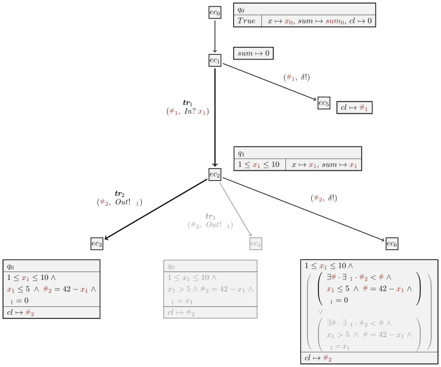
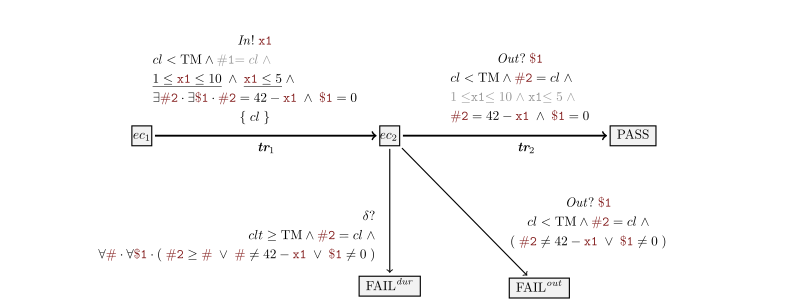

# Test case generation

The construction of the test case is obtained by applying dedicated symbolic execution techniques to the reference timed symbolic automaton, in order to derive a symbolic subtree restricted to the test purpose, i.e., a path represented as a sequence of transitions of the reference automaton. In the following, we **first provide an overview of these test-oriented symbolic techniques**, and **then describe the test case generation itself**, obtained by applying transformations to this subtree (mirroring and constraint simplifications).

## 1. Test-oriented Symbolic Execution Techniques

**Symbolic execution** explores a model by representing both data and time with symbolic variables instead of concrete values. It unfolds the automaton while generating constraints over symbolic variables, producing a **symbolic execution tree** . The tree's nodes are **execution contexts**, and its edges represent symbolic steps such as initialization, transition firing, or **quiescence completion**.

Recall the dummy automaton example (discussed [model specification tutorial](model_specification.md)):

The symbolic execution tree (restricted by test purpose transitions sequence $\mathbf{tr}_1.\mathbf{tr}_2$):

### Execution Contexts

An **execution context** $ec=(q, \pi, \lambda, ev, pec)$ consists of:
* The current state $q$.
* The **path condition** $\pi$ (accumulated constraints).
* The mapping $\lambda$ of variables and clocks to symbolic terms.
* The triggering event $ev$.
* The predecessor context $pec$.

The **root context** $ec_0$ starts in $q_0$, with clocks at zero, variables assigned fresh symbols, $\pi = True$, and $ev$ and $pec$ undefined. Initialization produces the first successor, $ec_1$.

**Symbolic Variables**: Fresh symbolic variables are introduced:

`x0`, `x1`, ... represent successive values of a data variable $x$ (with `x0` being the initial value).

`#1`, `#2`, ... denote **symbolic delays**.

`$1`, `$2`, ...  denote **emitted values** typed according to their channels.

### Symbolic Paths

Contexts $ec_2$, $ec_3$, and $ec_4$ illustrate the symbolic execution of transitions $\mathbf{tr}_1$, $\mathbf{tr}_2$, and $\mathbf{tr}_3$.

1.  **Edge from $ec_1$ to $ec_2$ ($\mathbf{tr}_1$)**:
    * Transition from $q_0$ to $q_1$ via input $In$.
    * $x$ is updated to `x1`. Clock $cl$ is reset to $0$.
    * Edge label: symbolic action $\mathit{In}?$`x1` and delay `#1`.
    * **Path condition**: 1 $\leq$ `x1` $\leq$ 10 (from guard $1 \leq x \leq 10$).
    * Update: $\mathit{sum} \mapsto$ `x1`.

2.  **Edge from $ec_2$ to $ec_3$ ($\mathbf{tr}_2$)**:
    * Transition from $q_1$ to $q_0$, emitting on channel $\mathit{Out}$.
    * `#2` is elapsed time, and `$1` is the emitted value. Clock value becomes `#2`.
    * **Path condition**: `x1` $\leq 5$ and `#2` = 42 -  `x1` (from guard $x \leq 5$ and $cl = 42 - x$), and `$1` = 0.

The symbolic path $ec_1.ec_2.ec_3$ corresponds to model path $\mathbf{tr}_1.\mathbf{tr}_2$, yielding the symbolic trace (`#1`, $\mathit{In}?$`x1`).(`#2`, $\mathit{Out}!$`$1`).

The **path condition** for this trace (`#1` is unconstrained) is:

1 $\leq$ `x1` $\leq$ 10 $\land$ `x1` $\leq$ 5 $\land$ `#2` = 42 - `x1` $\land$ `$1` = 0

This is **satisfiable** e.g. with `x1` $\mapsto$ 1, `$1` $\mapsto$ 0, `#1` $\mapsto$ 0, `#2` $\mapsto$ 41, producing the **timed trace** $(0, \mathit{In}?1).(41, \mathit{Out}!0)$. This trace shows the system receives $\mathit{In}?1$ after initialization and emits $\mathit{Out}!0$ 41 time units later.

### Completion by Quiescence

Contexts $ec_5$ and $ec_6$ model **quiescence** (system silence). Symbolic variables are reused across sibling contexts (e.g., `#1` for $ec_2$ and $ec_5$).

* **Quiescence context $ec_5$**: Derived from $ec_1$. The edge is labeled with the quiescence event (`#1`, $\delta!$). The system may remain silent indefinitely, reflected by $\pi = True$ and unconstrained delay `#1`.

* **Quiescence context $ec_6$**: Derived from $ec_2$'s output successors ($ec_3$ and $ec_4$). Its path condition is a disjunction of existential constraints (e.g., $\exists$ `#` $\cdot$ $\exists$ `$1` $\cdot$  `#2` < `#` $\wedge$ $\ldots$), capturing that quiescence persists until an output is possible.

* **Trace-determinism and pruning**: For a chosen Test Path (TP) $ec_1.ec_2.ec_3$ (which implies `x1` $\le$ 5), context $ec_4$ (which implies `x1` > 5) **conflicts** and is removed (grayed out). This simplifies $ec_6$'s path condition.

A **witness timed trace** $(0, \mathit{In}?1)\cdot(40, \delta!)$ covers $ec_6$ (with `x1` $\mapsto$ 1, `#2` $\mapsto$ 40), demonstrating that after $\mathit{In}?1$, the system can remain silent for 40 time units, expecting the next output at 41.

### SPTG Workflow

For a model $\mathbb{G}$, the **Symbolic Path-guided Test Generation (SPTG)** workflow restricts symbolic exploration to a **model path**  

$p = \textbf{tr}_1 \cdots \textbf{tr}_n$, chosen as a **test path (TP)**.  

Starting from the initial state $q_0$, the workflow performs **symbolic execution along** $p$, using the SMT solver **Z3** to verify:
- satisfiability of execution contexts,  
- trace-determinism, and  
- conflict detection.  

The workflow proceeds through the following five main steps:

1. **Symbolic execution along the path**  
   - From the current execution context $ec_1$, all successor contexts are computed (Custom Symbex).  
   - For each transition $\textbf{tr}_i$, the workflow checks whether it can be fired.  
   - If the transition is fireable, exploration continues from the successor produced by $\textbf{tr}_i$, exploring the remaining suffix  
     $p' = \textbf{tr}_{i+1} \cdots \textbf{tr}_n$.  
   - Otherwise, the exploration stops.

2. **Conflict removal**  
   - Any conflicting contexts detected during symbolic execution are removed.

3. **Trace-determinism verification**  
   - The workflow verifies that no two sibling contexts on the same channel could be covered by the same trace.  
   - Exploration halts if nondeterminism is detected.

4. **Incorporation of quiescence contexts**  
   - Quiescence contexts are added, producing a restricted, deterministic, quiescence-augmented symbolic execution tree  
     $SE(\mathbb{G})^{\delta}_{/p}$, which contains the path $p$ and its immediate trace-deterministic divergences.

5. **Test case synthesis**  
   - The final step synthesizes the **timed symbolic test case** $\mathbb{TC}_p$ from  
     $SE(\mathbb{G})^{\delta}_{/p}$.

In the following, we detail the construction of $\mathbb{TC}_p$, illustrated below for our running dummy example, and explain how SPTG generates it from the given model path $p$, which serves as the test purpose.

The test case which corresponds to the test purpose path $\mathbf{tr}_1.\mathbf{tr}_2$ (partial view):

## 2. Symbolic path-guided test case

The test case $\mathbb{TC}_p$ is defined as a **timed symbolic transition system** equipped with a **single clock** `cl`, which measures the elapsed time before each action it performs.  

The **data variable set** of $\mathbb{TC}_p$ includes all symbolic variables used to produce the execution contexts covering the path $p$.  
These variables represent the information known and manipulated by the test case as execution progresses, including:

- **Input values** to stimulate the SUT with (e.g., `x1`) and their associated **submission durations** (e.g., `#1`).  
- **Output values** expected from the SUT (e.g., `$1`) and their corresponding **observation times** (e.g., `#2`).

**Clock constraint**
  - The clock satisfies:
    $$
    cl < \text{TM}
    $$
    where $\text{TM}$ denotes the maximal waiting time before either:
    - applying a stimulation, or  
    - observing an output.

This timing mechanism, combined with quiescence detection ($cl \geq \text{TM}$), ensures that the test case can be implemented in a real-time environment. 

### Relation to symbolic execution

As illustrated in Fig.~\ref{fig:tiosts_symbex_tree}, the test case $\mathbb{TC}_p$ mirrors $SE(\mathbb{G})^{\delta}_{/p}$ and is used to **check the conformance** of the SUT to $\mathbb{G}$ along the symbolic path $p$.

---

### Execution structure

- The execution contexts related to path $p$ form the **main branch** leading to the verdict **`PASS`**.  
  The target context is replaced by `PASS`.  
- Any deviation from this branch triggers a verdict state:
  - **`FAIL`** if the behavior violates expectations.
  - **`INC`** (inconclusive) if no clear verdict can be determined.

---

### Guard derivation

The **guard** of the test-case transition from $ec_1$ to $ec_2$ is derived from the target of the test path (TP), denoted $ec_3$.  
It guides the selection of the stimulation $In!x_1$ along this path.  
The guard is expressed as:

$$
cl < \text{TM} \;\wedge\; 1 \leq x_1 \leq 10 \;\wedge\; x_1 \leq 5 \;\wedge\;
\exists \#_2 \cdot \exists \$_1 \cdot (\#_2 = 42 - x_1 \;\wedge\; \$_1 = 0)
$$

At this stage:
- $x_1$ and its duration $\#_1$ are determined.
- $\#_2$ and $\$_1$ remain undetermined.

The variable $x_1$ is constrained by the path condition of $ec_3$ (small inputs), whereas $\#_1$ is unconstrained and may be omitted (grayed).

---

### Quantifier simplification

Conditions producing $ec_3$ are, by default, under existential quantifiers:

$$
\exists \#_2 \;\exists \$_1 \;\big( x_1 \leq 5 \;\wedge\; \#_2 = 42 - x_1 \;\wedge\; \$_1 = 0 \big)
$$

Since $\#_2$ and $\$_1$ do not occur freely in $x_1 \leq 5$, this constraint is moved outside the quantifiers, yielding the **final guard**.

---

### Expected observation and transition to `PASS`

Following the test path, the test case expects an observation $Out?\$_1$ on channel `Out`, storing it in $\$_1$.  
It transitions from $ec_2$ to `PASS` under the following guard:

$$
cl < \text{TM} \;\wedge\; \#_2 = cl \;\wedge\; 1 \leq x_1 \leq 10 \;\wedge\;
x_1 \leq 5 \;\wedge\; \#_2 = 42 - x_1 \;\wedge\; \$_1 = 0
$$

- The formulas $1 \leq x_1 \leq 10$ and $x_1 \leq 5$ appear *grayed* because they are inherited from earlier transitions.
- The remaining guard ensures that:
  - the observed value $\$_1$ matches the expected output $0$ for small inputs ($x_1 \leq 5$), and  
  - the measured duration $\#_2$ recorded by $cl$ equals $42 - x_1$.

---

### Verdict transitions

- **Transition to `FAIL^{out}`**  
  Triggered when $\#_2$ is within the time limit ($\text{TM}$), but either the duration or the observed value $\$_1$ violates the guard from $ec_2$ to `PASS`.

- **Transition to `FAIL^{dur}`**  
  Captures **invalid quiescence**, defined by:

  $$
  cl \geq \text{TM} \;\wedge\; \#_2 = cl \;\wedge\;
  \forall \# \cdot \forall \$_1 \cdot (\#_2 \geq \# \;\vee\; \# \neq 42 - x_1 \;\vee\; \$_1 \neq 0)
  $$

---

### Example verdicts (for $\text{TM} = 60$)

| Verdict | Trace | Description |
|----------|--------|-------------|
| **PASS** | $(0, In?1).(41, Out!0)$ | Valid output and timing |
| **FAIL$^{out}$** | $(0, In?1).(40, Out!0)$ or $(0, In?1).(41, Out!1)$ | Output mismatch or incorrect timing |
| **FAIL$^{dur}$** | $(0, In?1).(60, \delta!)$ | Quiescence beyond allowed duration |

The last trace shows quiescence exceeding the allowed duration, with only $(41, Out!0)$ as a valid output after $(0, In?1)$, resulting in a `FAIL^{dur}` verdict.

---

### Additional material

- Other test case transitions are illustrated in Fig.~\ref{fig:tc_xlia_puml}, labeled in **Diversity syntax** for readability.  
- A 5-depth test case is presented in Fig.~\ref{fig:tc_xlia_puml_len_5} in the appendix.

