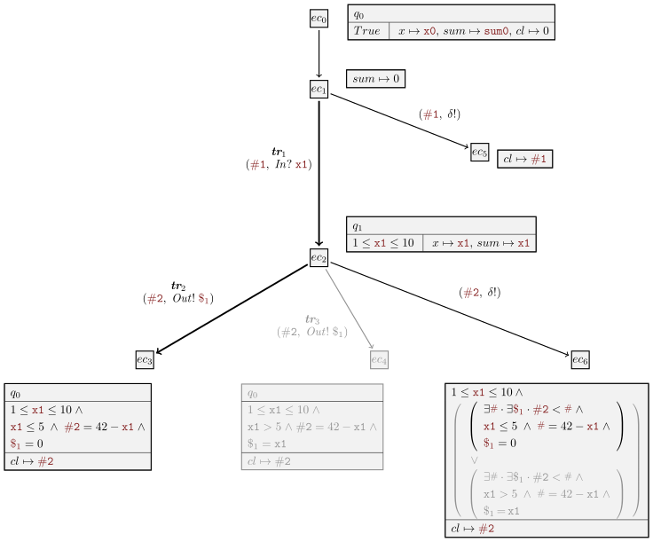
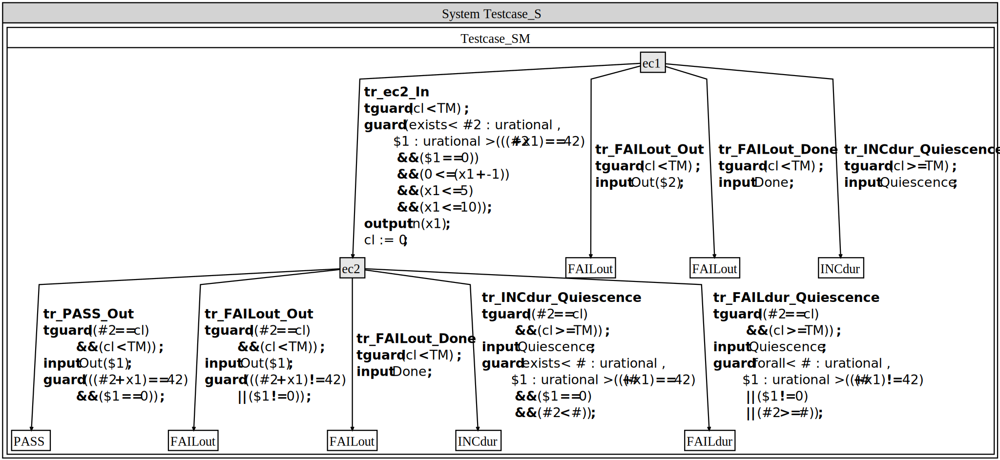

<!---
<script type="text/javascript" src="http://cdn.mathjax.org/mathjax/latest/MathJax.js?config=TeX-AMS-MML_HTMLorMML"></script>
<script type="text/x-mathjax-config"> MathJax.Hub.Config({ tex2jax: {inlineMath: [['$', '$']]}, messageStyle: "none" });</script>
--->
# Test case generation

The construction of the test case is obtained by applying dedicated symbolic execution techniques to the reference timed symbolic automaton, in order to derive a symbolic subtree restricted to the test purpose, i.e., a path represented as a sequence of transitions of the reference automaton. In the following, we **first provide an overview of these test-oriented symbolic techniques**, and **then describe the actual test case generation**, obtained by applying specific transformations to this subtree (mirroring and constraint simplification). Finally, we show **how to use SPTG to generate the test cases**.


## Table of content

1. [Test-oriented Symbolic Execution Techniques](#test-oriented-symbolic-execution-techniques)
2. [Symbolic Path-guided Test Case](#symbolic-path-guided-test-case)
3. [Using SPTG](#using-sptg)
---
## Test-oriented Symbolic Execution Techniques
---
**Symbolic execution** explores a model by representing both data and time with symbolic variables instead of concrete values. It unfolds the automaton while generating constraints over symbolic variables, producing a **symbolic execution tree** . The tree's nodes are **execution contexts**, and its edges represent symbolic steps such as initialization, transition firing, or **quiescence completion**.

Consider the following dummy automaton example:

<div style="padding-top: 20px; padding-bottom: 20px;">
</div>

<center>


</center>

<div style="padding-top: 20px; padding-bottom: 20px;">
</div>

The symbolic execution tree (restricted by test purpose transitions sequence $\mathbf{tr}_1.\mathbf{tr}_2$):


<div style="padding-top: 20px; padding-bottom: 20px;">
</div>

<center>


</center>

<div style="padding-top: 20px; padding-bottom: 20px;">
</div>

### Execution Contexts

An **execution context** $ec=(q, \pi, \lambda, ev, pec)$ consists of:
* The current state $q$.
* The **path condition** $\pi$ (accumulated constraints).
* The mapping $\lambda$ of variables and clocks to symbolic terms.
* The triggering event $ev$.
* The predecessor context $pec$.


The **root context** $ec_0$ starts in $q_0$, with clocks at zero, variables assigned fresh symbols, $\pi = True$, and $ev$ and $pec$ undefined. Initialization produces the first successor, $ec_1$ (still in $q_0$), where only
updated components are shown. For instance, if initialization only updates $sum:=0$, we display $sum \mapsto 0$.

**Symbolic Variables**: Fresh symbolic variables are introduced:

`x0`, `x1`, ... represent successive values of a data variable $x$ (with `x0` being the initial value).

`#1`, `#2`, ... denote **symbolic delays**.

`$1`, `$2`, ...  denote **emitted values** typed according to their channels.


### Symbolic Paths

Contexts $ec_2$, $ec_3$, and $ec_4$ illustrate the symbolic execution of transitions $\mathbf{tr}_1$, $\mathbf{tr}_2$, and $\mathbf{tr}_3$.

1.  **Edge from $ec_1$ to $ec_2$ ($\mathbf{tr}_1$)**:
    * Transition from $q_0$ to $q_1$ via input $In$.
    * $x$ is updated to `x1`. Clock $cl$ is reset to $0$.
    * Edge label: symbolic action $\mathit{In}?$`x1` and delay `#1`.
    * **Path condition**: 1 $\leq$ `x1` $\leq$ 10 (from guard $1 \leq x \leq 10$).
    * Update: $\mathit{sum} \mapsto$ `x1`.

2.  **Edge from $ec_2$ to $ec_3$ ($\mathbf{tr}_2$)**:
    * Transition from $q_1$ to $q_0$, emitting on channel $\mathit{Out}$.
    * `#2` is elapsed time, and `$1` is the emitted value. Clock value becomes `#2`.
    * **Path condition**: `x1` $\leq 5$ and `#2` = 42 -  `x1` (from guard $x \leq 5$ and $cl = 42 - x$), and `$1` = 0.

The symbolic path $ec_1.ec_2.ec_3$ corresponds to model path $\mathbf{tr}_1.\mathbf{tr}_2$, yielding the symbolic trace (`#1`, $\mathit{In}?$`x1`).(`#2`, $\mathit{Out}!$`$1`).

The **path condition** for this trace (`#1` is unconstrained) is:

1 $\leq$ `x1` $\leq$ 10 $\land$ `x1` $\leq$ 5 $\land$ `#2` = 42 - `x1` $\land$ `$1` = 0

This is **satisfiable** e.g. with `x1` $\mapsto$ 1, `$1` $\mapsto$ 0, `#1` $\mapsto$ 0, `#2` $\mapsto$ 41, producing the **timed trace** $(0, \mathit{In}?1).(41, \mathit{Out}!0)$. This trace shows the system receives $\mathit{In}?1$ after initialization and emits $\mathit{Out}!0$ 41 time units later.


### Completion by Quiescence

Contexts $ec_5$ and $ec_6$ model **quiescence** (system silence). Symbolic variables are reused across sibling contexts (e.g., `#1` for $ec_2$ and $ec_5$).

* **Quiescence context $ec_5$**: Derived from $ec_1$. The edge is labeled with the quiescence event (`#1`, $\delta!$). The system may remain silent indefinitely, reflected by $\pi = True$ and unconstrained delay `#1`.

* **Quiescence context $ec_6$**: Derived from $ec_2$'s output successors ($ec_3$ and $ec_4$). Its path condition is a disjunction of existential constraints (e.g., $\exists$ `#` $\cdot$ $\exists$ `$1` $\cdot$  `#2` < `#` $\wedge$ $\ldots$), capturing that quiescence persists until an output is possible.

* **Trace-determinism and pruning**: For a chosen Test Path (TP) $ec_1.ec_2.ec_3$ (which implies `x1` $\le$ 5), context $ec_4$ (which implies `x1` > 5) **conflicts** and is removed (grayed out). This simplifies $ec_6$'s path condition.

A **witness timed trace** $(0, \mathit{In}?1)\cdot(40, \delta!)$ covers $ec_6$ (with `x1` $\mapsto$ 1, `#2` $\mapsto$ 40), demonstrating that after $\mathit{In}?1$, the system can remain silent for 40 time units, expecting the next output at 41.


### SPTG Workflow

For a model $\mathbb{G}$, **SPTG workflow** restricts symbolic exploration to a **model path** $p = \textbf{tr}_1 \cdots \textbf{tr}_n$, chosen as a **test purpose path (TP)**.  

Starting from the initial state $q_0$, the workflow performs **symbolic execution along** $p$, using the SMT-solver **Z3** to verify:
- satisfiability of execution contexts,  
- trace-determinism, and  
- conflict detection.  

The workflow proceeds through the following five main steps:

1. **Symbolic execution along the path**  
   - From the current execution context $ec_1$, all successor contexts are computed.  
   - For each transition $\textbf{tr}_i$, the workflow checks whether it can be fired.  
   - If the transition is fireable, exploration continues exploring the remaining suffix $p'=\textbf{tr}_{i+1}\cdots\textbf{tr}_n$ from the successor produced by $\textbf{tr}_i$, .  
   - Otherwise, the exploration stops.

2. **Conflict removal**  
   - Any conflicting contexts detected during symbolic execution are removed.

3. **Trace-determinism verification**  
   - The workflow verifies that no two sibling contexts on the same channel could be covered by the same trace.  
   - Exploration halts if nondeterminism is detected.

4. **Incorporation of quiescence contexts**  
   - Quiescence contexts are added, producing a restricted, deterministic, quiescence-augmented symbolic execution tree  $SE(\mathbb{G})^{\delta}_{/p}$, which contains the path  and its immediate trace-deterministic divergences.

5. **Test case synthesis**  
   - The final step synthesizes from $SE(\mathbb{G})^{\delta}_{/p}$ the timed symbolic test case $\mathbb{TC}_p$.

In the following, we detail the construction of $\mathbb{TC}_p$, illustrated below for our running dummy example, and explain how SPTG generates it from the given model path $p$, which serves as the test purpose.


The test case $\mathbb{TC}_{\mathbf{tr}_1.\mathbf{tr}_2}$ which corresponds to the test purpose path $\mathbf{tr}_1.\mathbf{tr}_2$ (partial view):


<div style="padding-top: 20px; padding-bottom: 20px;">
</div>

<center>


</center>

<div style="padding-top: 20px; padding-bottom: 20px;">
</div>

---
## Symbolic Path-guided Test Case
---
The test case $\mathbb{TC}_p$ is defined as a **timed symbolic transition system** equipped with a **single clock** $cl$, which measures the elapsed time before each action it performs.  

The **data variable set** of $\mathbb{TC}_p$ includes all symbolic variables used to produce the execution contexts covering the path $p$.  
These variables represent the information known and manipulated by the test case as execution progresses, including:

- **Input values** to stimulate the SUT with (e.g., `x1`) and their associated **submission durations** (e.g., `#1`).  
- **Output values** expected from the SUT (e.g., `$1`) and their corresponding **observation times** (e.g., `#2`).

**Clock constraint**
  - The clock satisfies:
    
    $cl$ < $\text{TM}$
    
    where $\text{TM}$ denotes the maximal waiting time before either:
    - applying a stimulation, or  
    - observing an output.

This timing mechanism, combined with quiescence detection ($cl \geq \text{TM}$), ensures that the test case can be implemented in a real-time environment. 

### Test case general structure

The test case mirrors $SE(\mathbb{G})^{\delta}_{/p}$ and is used to **check the conformance** of the SUT to $\mathbb{G}$ along the symbolic path $p$.

 Roughly speaking, test case structure is obtained as follows:

- The execution contexts related to path $p$ form the **main branch** leading to the verdict **$\text{PASS}$**.  
  The target context is replaced by **$\text{PASS}$**.  
- Any deviation from this branch triggers a verdict state:  
  - **$\text{FAIL}$** if the behavior violates the model.  
  - **$\text{INC}$** (inconclusive) if the behavior does not violate the model but does not cover $p$.


### Test case guard derivation

The **guard** of the test-case transition from $ec_1$ to $ec_2$ is derived from the target of the test path (TP), denoted $ec_3$.  
It guides the selection of the stimulation $In!x_1$ along this path.  
The guard is expressed as:


$cl$ < $\text{TM}$ $\wedge$ 1 $\leq$ `x1` $\leq$ 10 $\wedge$ `x1` $\leq$ 5 $\wedge$ $\exists$ `#2` $\cdot$ $\exists$ `$1` $\cdot$ (`#2` = 42 - `x1` $\wedge$ `$1` = 0)

At this stage:  
- `x1` and its duration `#1` are determined.  
- `#2` and `$1` remain undetermined.  

The variable `x1` is constrained by the path condition of $ec_3$ (corresponding to small input values), whereas `#1` is unconstrained and can therefore be omitted (shown as grayed out in the explanatory figure of the test case $\mathbb{TC}_{\mathbf{tr}_1.\mathbf{tr}_2}$).

Conditions producing $ec_3$ are, by default, under existential quantifiers: $\exists$ `#2` $\cdot$ $\exists$ `$1` $\cdot$ (`x1` $\leq$ 5 $\wedge$  $\cdot$ `#2` = 42 - `x1` $\wedge$ `$1` = 0). 
Since `#2` and `$1` do not occur freely in `x1` $\leq$ 5, this constraint is moved outside the quantifiers, yielding the final guard.

Following the test path, the test case expects an observation $Out?$`$1` on channel  $Out$, storing it in `$1`.  
It transitions from $ec_2$ to $\text{PASS}$ under the following guard:


$cl$ < $\text{TM}$ $\wedge$ `#2` = cl $\wedge$ 1 $\leq$ `x1` $\leq$ 10 $\wedge$ `x1` $\leq$ 5 $\wedge$ `#2` = 42 - `x1` $\wedge$ `$1` = 0


- The formulas 1 $\leq$ `x1` $\leq$ 10  and `x1` $\leq$ 5 appear *grayed* because they are inherited from earlier transitions.
- The remaining guard ensures that:
  - the observed value `$1` matches the expected output $0$ for small inputs (`x1` $\leq$ 5), and  
  - the measured duration `#2` recorded by $cl$ equals 42 - `x1`.

Transition to $\text{FAIL}^{out}$ is triggered when `#2` is within the time limit ($\text{TM}$), but either the duration or the observed value `$1` violates the guard from $ec_2$ to $\text{PASS}$:

$cl$ < $\text{TM}$ $\wedge$ `#2` = cl $\wedge$ 1 $\leq$ `x1` $\leq$ 10 $\wedge$ `x1` $\leq$ 5 $\wedge$ (`#2` $\neq$ 42 - `x1` $\lor$ `$1` $\neq$ 0 )

Transition to $\text{FAIL}^{dur}$ captures invalid quiescence, defined by:

  $cl$ $\geq$ $\text{TM}$ $\wedge$ `#2` = $cl$ $\wedge$
  $\forall$ `#` $\cdot$ $\forall$ `$1` $\cdot$ (`#2` $\geq$ `#` $\vee$ `#` $\neq$ 42 - `x1` $\vee$ `$1` $\neq$ 0)

  Other test case transitions are shown in (complete) test case image generated by SPTG.

### Example verdicts (for $\text{TM} = 60$)

| Verdict | Trace | Description |
|----------|--------|-------------|
| **$\text{PASS}$** | $(0, In?1).(41, Out!0)$ | Valid output and timing |
| **$\text{FAIL}^{out}$** | $(0, In?1).(40, Out!0)$ | Incorrect timing|
| **$\text{FAIL}^{out}$** | $(0, In?1).(41, Out!1)$ | Output mismatch |
| **$\text{FAIL}^{dur}$** | $(0, In?1).(60, \delta!)$ | Quiescence beyond allowed duration |

The last trace shows quiescence exceeding the allowed duration, with only $(41, Out!0)$ as a valid output after $(0, In?1)$, resulting in a $\text{FAIL}^{dur}$ verdict.

---
## Using SPTG
---
Navigate to the `/path/to/SPTG/examples/example02_dummy/` directory, then run: 
```bash
cd /path/to/SPTG/examples/example02_dummy/
./run-sptg-h2.sh
```
Script `run-sptg-h2.sh` invokes the SPTG executable `/path/to/SPTG/bin/sptg.exe` using the workflow configuration file:

**File** `/path/to/SPTG/examples/example02_dummy/workflow_4_testcase_generation_h2.sew` 

An excerpt from this file:
```
workspace [
		root   = "example02_dummy"
		launch = "example02_dummy"
		output = "output_h2"
] // end workspace
...
project 'path of input model' [
  source = "."
    model  = "example02_dummy.xlia"
] // end project
...
path#guided#testcase#generator testcase_genertor {
    ...
    trace [
      //Sequence of elements characterizing the test purpose.
      transition = "tr1"
      transition = "tr2"
    ] // end trace
    vfs [
        file#tc       = "testcase.xlia"
        file#tc#puml  = "testcase.puml"
    ] // end vfs
    ...
}
...
```
**SPTG** generates the resulting **test case automaton** in the following formats:


- **Graphical format: PlantUML**  
  **File** `/path/to/SPTG/examples/example02_dummy/output_h2/testcase.puml`  
  *Comment:* This file provides a visual representation of the test case automaton, which can be rendered using PlantUML.


- **JSON format with SMT-LIB guards**  
  **File** `/path/to/SPTG/examples/example02_dummy/output_h2/testcase_smt.json`  
  *Comment:* This JSON file encodes the test case automaton, including guards in SMT-LIB format, suitable for automated execution againt system under test (SUT) using an SMT-solver (e.g. Z3).

- **Specification language: XLIA**  
  The same language used to express the reference model.  
  **File** `/path/to/SPTG/examples/example02_dummy/output_h2/testcase.xlia`  
  *Comment:* This file can be explored using the symbolic execution platform Diversity.

> **Note:** The script also generates the graphical **PlantUML** file for the reference automaton:  
> **File** `/path/to/SPTG/examples/example02_dummy/output_h2/example02_dummy.puml`  
> *Comment:* This file provides a visual representation of the reference automaton. 

> **Note:** If the **PlantUML JAR** and the **Graphviz** are configured, the script automatically produces:  
> **File** `/path/to/SPTG/examples/example02_dummy/output_h2/testcase.svg`  
> **File** `/path/to/SPTG/examples/example02_dummy/output_h2/example02_dummy.svg`.


The table below summarizes the inputs and outputs for generating the **test case** with SPTG:


| **Description** | **Content** |
|-----------------|-------------|
| **Input 1:** *Reference system model (Timed Symbolic Automaton)* |  |
| **Input 2:** *Test purpose (Sequence of transitions)* | `tr1; tr2` |
| **Output:** *Generated test case (Deterministic Timed Symbolic Automaton)* |  |

To generate another test purpose of length 5 for the same reference model, run:

```bash
cd /path/to/SPTG/examples/example02_dummy/
./run-sptg-h5.sh
```
This script executes the workflow configured for a longer test purpose (length 5).
As a result, you obtain the following generated test case:

| **Description** | **Content** |
|-----------------|-------------|
| **Input 2:** *Test purpose (Sequence of transitions)* | `tr1; tr2; tr1; tr3; tr4` |
| **Output:** *Generated test case (Deterministic Timed Symbolic Automaton)* |  |

