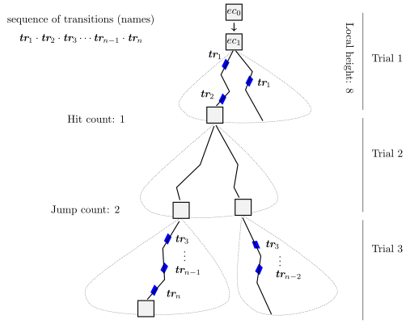
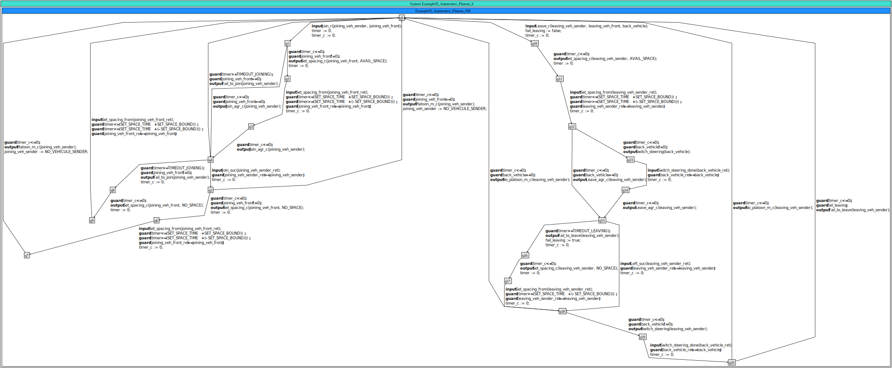

<!---
<script type="text/javascript" src="http://cdn.mathjax.org/mathjax/latest/MathJax.js?config=TeX-AMS-MML_HTMLorMML"></script>
<script type="text/x-mathjax-config"> MathJax.Hub.Config({ tex2jax: {inlineMath: [['$', '$']]}, messageStyle: "none" });</script>
--->

# Test purpose selection using Hit-or-Jump (HoJ) exploration heuristic

In the **test case generation** process, the objective is to compute a **symbolic subtree** of the reference timed symbolic automaton restricted by a **test purpose**, defined as a **consecutive sequence of transitions** to be covered.

To enable the **selection of such sequences** from the model, the **Hit-or-Jump (HoJ)** exploration heuristic provided as a dedicated function of **SPTG**, inherited from the symbolic execution platform **Diversity** can be used. This heuristic guides symbolic exploration toward specific behavioral goals while avoiding exhaustive exploration of irrelevant paths.

The user is interested in some behavior which can be seen **a set or sequence of reachable artefacts** during symbolic execution, i.e. coverage goal, which may include:
- firing transitions  
- recahing states  
- evaluation of input/output statements on involved ports.  

The main idea of HoJ iteratively explores the symbolic tree to **find a symbolic path** that satisfies this desired coverage goal.  


Once such a symbolic path is identified:
- It corresponds to a **consecutive sequence of transitions** in the automaton.  
- This sequence can serve as the input **test purpose** for the **SPTG test case generation** process.  

## Table of content

1. [Principle of the HoJ heuristic](#principle-of-the-HoJ-heuristic)
2. [Coverage Modes](#coverage-modes)
3. [Heuristic Parameters](#coverage-modes)
4. [Using SPTG](#using-sptg)

---
## Principle of the HoJ Heuristic
---
Assuming the **coverage goal** is a **sequence of (non-consecutive) transitions** which must be covered in order but the HoJ can fill the gaps in between to find the covering symbolic path (if any). During symbolic execution, HoJ drives the exploration of the symbolic automaton so that the generated symbolic tree **progressively covers prefixes** of this sequence until full coverage is achieved as illustrated in th the following figure (Schematic illustration of HoJ trials and coverage progression):


<div style="padding-top: 20px; padding-bottom: 20px;">
</div>

<center>

</center>

<div style="padding-top: 20px; padding-bottom: 20px;">
</div>


The symbolic tree is built **incrementally and adaptively** through a series of **trials**. In each trial, HoJ computes a symbolic subtree of **bounded local height N** using a **breadth-first traversal**. Once the subtree is constructed, it is analyzed to measure the degree of coverage achieved for the target sequence.

- **Hit:** If at least one non-empty prefix of the sequence is covered, HoJ selects, at random, one or several **execution contexts (ECs)** corresponding to the **maximum prefix coverage** and restarts exploration from these ECs.  
- **Jump:** If no prefix is covered, HoJ randomly selects one or several ECs in the subtree to restart the breadth-first exploration from their corresponding states.

This process is **iteratively repeated** (Trial 1, Trial 2, …) until the full target sequence is covered. Each local subtree (bounded by dotted areas) corresponds to one trial, alternating between **Hit** and **Jump** phases until complete coverage is achieved.

---
## Coverage Modes
---
HoJ supports different **coverage modes**, depending on the structure of the declared test purpose and the desired level of strictness:


- **Consecutive coverage:** requires transitions be covered **in the declared order**.  

- **Sequence coverage:** requires that transitions be covered **in their declared order**, possibly with **gaps** in between.


These modes provide flexibility in defining **how tightly the heuristic should follow the declared sequence**, depending on the abstraction level of the model or the granularity of coverage desired.

---
## Heuristic Parameters
---

The HoJ heuristic is controlled by several key parameters that determine its exploration behavior:

- **Local height (N):** the maximal depth of each symbolic subtree computed using BFS during a trial.  
- **Hit count:** the number of ECs with maximal coverage selected at random to restart the next BFS exploration in case of a Hit.  
- **Jump count:** the number of ECs chosen at random to restart exploration when no coverage progress is observed.  
- **Trial count:** the number of allowed re-starts (iterations) of the HoJ process.

Tuning these parameters allows balancing **exploration depth** and **search focus**, ensuring that the heuristic converges efficiently toward a subtree that satisfies the **coverage goal**.

---
## Using SPTG
---
Consider an automaton model representing a leader agent that manages the insertion and departure of vehicles in a platoon, ensuring safe spacing and coordination. The model is encoded as a timed symbolic transition system corresponding to a UPPAAL model [https://doi.org/10.1016/J.SCICO.2017.05.006](https://doi.org/10.1016/J.SCICO.2017.05.006) *(Open Access)*. This model is interesting for illustrating the HoJ, as it exhibits long, intertwined transition paths, making it difficult to identify the exact sequence of consecutive transitions needed to realize certain desired behaviors.

The textual model is available here ``path/to/SPTG/examples/example05_automotive_platoon/example05_automotive_platoon.xlia` and depicted below (Zoom-in for details):

<div style="padding-top: 20px; padding-bottom: 20px;"></div>

<center>

</center>

<div style="padding-top: 20px; padding-bottom: 20px;"></div>

Navigate to the `/path/to/SPTG/examples/example05_automotive_platoon/` directory, and then run the preconfigured script:

```bash
cd /path/to/SPTG/examples/example05_automotive_platoon/
./run-sptg-4-testpurpose-selection.sh
```
Script `run-sptg-4-testpurpose-selection.sh` invokes `sptg.exe` using the workflow configuration file:

**File** `/path/to/SPTG/examples/example05_automotive_platoon/workflow_4_testpurpose_selection.sew` 

An excerpt from this file:
```
...
coverage#behavior behavior_coverage {
    ...
    trace [
        transition = 'q0.tr_join_r'
        transition = 'q4.tr_joined_suc'
        transition = 'q7.tr_platoon_m_c'
	] // end trace
    heuristic [
        hit#consecutive = false
        jump#height = 3
        jump#trials#limit = 42
        hit#count  = 1
        jump#count = 1
        ...
	] // end heuristic
}
..
serializer#symbex#trace#basic basic_trace_generator {
    format [
		testcase#header = '// Sequence of transitions as testpurpose\n'
		transition = '\ttransition = %3%\n'
	] // end format
	vfs [
		folder = "."
		file   = "testpurpose.txt"
    ] // end vfs
}
...
```


The user input is a sequence of (non-consecutive) transitions  

`q0.tr_join_r; q4.tr_joined_suc; q7.tr_platoon_m_c` 

The sequence represents the following behavioral steps in the platooning process:  
- a **platoon join request**,  
- a **successful joining phase**, and  
- a **confirmation of switching to automatic platoon mode** for the joining vehicle.  

**Figure 1** illustrates how these symbolic transitions correspond to a **real-world scenario** involving a vehicle (`vehJ`) joining an existing platoon.  
It depicts the different stages of the process, from initiating the join request, through the coordinated merging maneuver, to the successful integration and activation of autonomous driving mode.

<div style="display: flex; flex-direction: column; align-items: center; margin: 20px 0;">
    
    <p style="text-align: center; font-size: 0.9em; color: #555; margin-top: 8px;">
        <strong>Figure 1:</strong> Real-world representation of the <code style="background-color: #ffcc00; padding: 2px 4px; border-radius: 3px; color: #000;">join-middle-succ</code> scenario, showing the joining vehicle (<code style="background-color: #ffcc00; padding: 2px 4px; border-radius: 3px; color: #000;">vehJ</code>) progressively integrating into the platoon.
    </p>
</div>


This execution generates a file:  
`/path/to/SPTG/examples/example05_automotive_platoon/output_testpurpose_selection/testpurpose.txt`  
with the following content:
 ```
// Sequence of transitions as testpurpose
	transition = q0.tr_join_r
	transition = q1.tr_set_spacing_c
	transition = q2.tr_set_spacing_from
	transition = q3.tr_join_agr_c
	transition = q4.tr_joined_suc
	transition = q5.tr_set_spacing_c
	transition = q6.tr_set_spacing_from
	transition = q7.tr_platoon_m_c
 ```


This output corresponds to a **feasible symbolic path** of the model, representing a **consecutive sequence of transitions** that includes both the user-specified transitions and the additional ones inferred by the heuristic to connect them according to the model’s behavior.  

Recall that the user input sequence contains only three transitions:  
`q0.tr_join_r; q4.tr_joined_suc; q7.tr_platoon_m_c` 

During exploration, the HoJ heuristic **filled in the gaps** between these transitions with intermediate transitions obtained from the model:  

- Between `q0.tr_join_r` and `q4.tr_joined_suc`, the heuristic identified  
  `q1.tr_set_spacing_c`, `q2.tr_set_spacing_from`, and `q3.tr_join_agr_c`.  
- Between `q4.tr_joined_suc` and `q7.tr_platoon_m_c`, it inserted  
  `q5.tr_set_spacing_c` and `q6.tr_set_spacing_from`.  
  
The resulting consecutive sequence can then be used as a **test purpose** for SPTG to generate a concrete test case.


